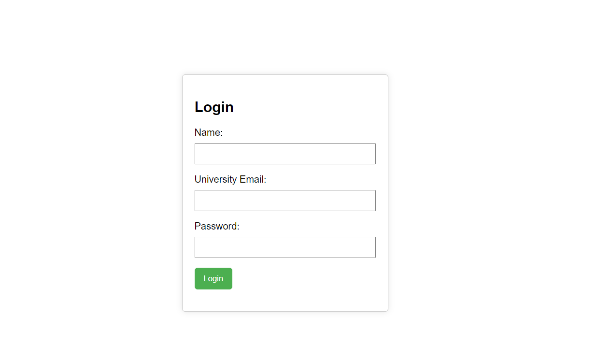
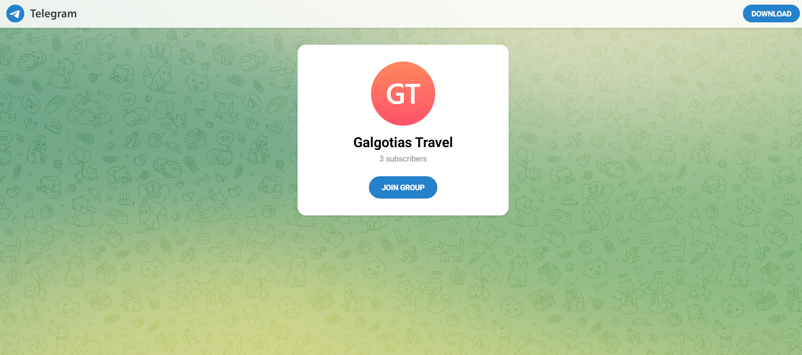

# I_BOT_STUDENT

# This project is made with the help of Asmita Sonal

To run this project you needs to have

PHP in your system
Pylance and some necessary extensions in your IDEs
Some nescessary PHP extensions in your IDEs
PHP Server in your system
Telebot is also needed in your IDEs After installing all necessary dependency in your IDEs your can run this code properly

